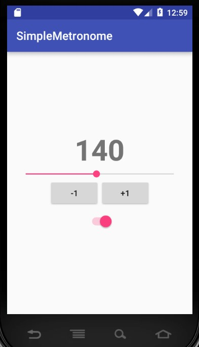

# SimpleMetronome

My first android project, which is a really simple metronome. Tested it on Android 4.4.4 (Kitkat).
For playing sound I used SoundPool and only changed the rate for different BPMs. I also tried with MediaPlayer, but it just wasnt accurate enough.

BPMs are possible from 30 to 260 (maybe a little exaggerated).

